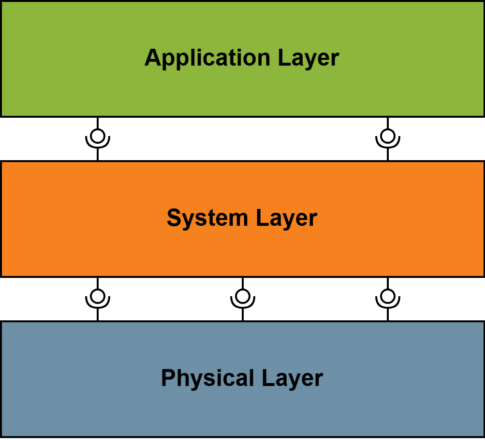

# Introduction and Goals {#section-introduction-and-goals}
The FullStaQD reference architecture is the first step towards modular full-stack quantum software, which ensures compatibility and interoperability of various components in the quantum ecosystem. We aim to develop a reference architecture with uniform standardised interfaces, which is consistent, modular and open. 

## Overview 
The reference architecture is divided into three layers: Application, System and Physical Layer.

In addition to these three layers, the architecture also defines cross-layer concerns, which can show up in any of the layers. 

The table below provides a brief description of the layers and the cross-layer concerns.

| Module  | Description | 
| ------------- | ------------- | 
| Application Layer | Contains all components on a high-level programming language or algorithmic level  |
| System Layer  | Contains all components to adjust high-level program to the specific hardware and to integrate HPC |
| Physical Layer  | Contains all components on a physical layer which indirectly/directly communicate with the physical quantum device  |
| Cross-Layer Concerns  | Is part of each Layer and contains all components like Testing, Benchmarking, Simulations, Tools, Visualization, ...  |

A detailed breakdown of the components of the layers can be seen in the [building block view](./05_building_block_view.md).

## Quality Goals {#_quality_goals}
To maintain a state of the art reference architecture in the quantum ecosystem, we consider the following quality goals as most important for this architecture.

| Quality Goal  | Description | 
| ------------- | ------------- | 
| Operability  | The reference architecture can be understood, learned, used and is attractive to users from academia and industry  |
| Compatibility  | HPCs and existing infrastructure can be integrated into the reference architecture using specific interfaces  |
| Maintainability  | The reference architecture can be modified, corrected, adapted or improved due to changes in the environment or requirements with ease |
| Modularity  | Systems, components or whole layers can be integrated and are exchangeable into the reference architecture using specified interfaces  |
| Reliability  | The reference architecture can maintain a high level of performance  when used under specific conditions  |

## Stakeholders {#_stakeholders}
The FullStaQD reference architecture is designed for research at universities as well as for practical use within the industry.
For further Information visit [our website](https://tva.kastel.kit.edu/english/research_fullstaqd.php).

## Methodology  
To fulfill the requirements and goals of the reference architecture, we consider several key aspects that are fundamental to the design of modern software architectures:

- the multitude of perspective of stakeholders and use cases
- the multitude of abstractions, where most expertise of stakeholders focuses only a specified area
- the multitude of languages, which are used by the different domain experts  (physicists, software-engineers, mathematicians, ...)
- the rapid advancement in the quantum eco system

To address these aspects and continuously validate and refine the reference architecture, we employ a set of state-of-the-art methods from classical software engineering:
 <!--  Hier könnte man Paper oder Ergebnisse hinten noch als Spalte in Zukunft Verlinken -->
| Method  | Description | Reason | 
| ------------- | ------------- | ------------- | 
| Scenario-based analysis | Using predefined scenarios of use cases on the reference architecture  | To assess how well the reference architecture covers the predefined use cases and to identify the common requirements shared by the components on which those use cases depend |
| Requirement Survey  | Sending surveys to stakeholders asking for requirements and needs for their components | Obtaining high-level input on the requirements that the reference architecture must fulfill  |
| Interview with Stakeholders  | In-depth interviews with stakeholders about the reference architecture and their respective positions  | Acquiring detailed insights of Stakeholders and adopt their input  |
| Workshops  | Regular on-site exchange with the consortium  | Updating partners of current status and discussing next steps |
| Community Engagement | Allowing open requests and discussion about the reference architecture through our ticket system | Ensuring external input, extendability and exchangability | 

This project is supported and funded by the German Federal Ministry of Research, Technology and Space in project FullStaQD under Grant No.: 01MQ25001F.

 

[![alt text][image]][hyperlink]

[hyperlink]: https://www.bmftr.bund.de/EN/Home/home_node.html
[image]: ./images/BMFTR_Logo.jpg

[![alt text][image1]][hyperlink1]

[hyperlink1]: https://www.bmftr.bund.de/EN/Technology/HightechAgenda/HightechAgenda.html
[image1]: ./images/HightechAgendaLogo.jpg

