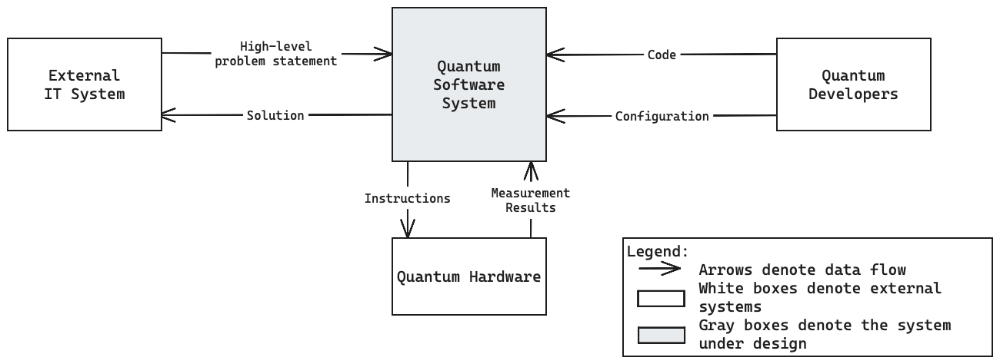
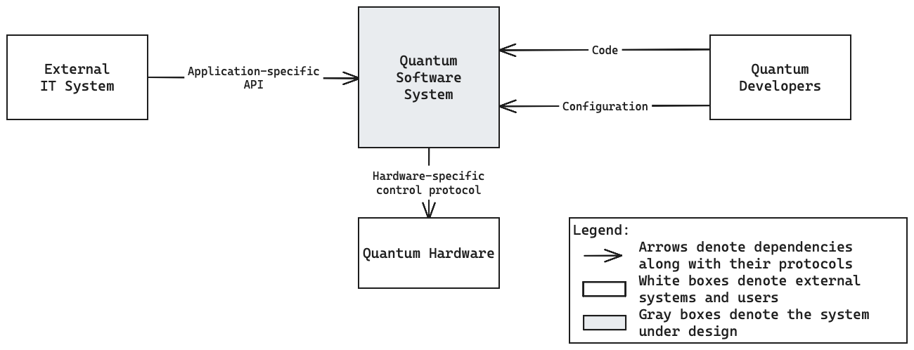

# Context and Scope {#section-context-and-scope}

Quantum software systems can be any system that involves tasks solved on quantum
computers.
As this reference architecture remains highly general, we characterise typical
properties of the context of such systems rather than one specific context.

## Business Context {#_business_context}

<figure markdown="span">
  
</figure>

* The **Quantum Software System** is at the heart of the above diagram.
  Its [internal structure](./05_building_block_view.md),
  [behaviour](./06_runtime_view.md) and [deployment](./07_deployment_view.md)
  are characterised in the respective sections.
* **External IT Systems** such as business applications can call quantum
  software systems with application-specific problem statements.
  The use of quantum algorithms, problem transformations and circuit
  formulations is part of application-specific components which are part of the
  quantum software system
  (see [application layer](./05_building_block_view.md)).
  <!--
    TODO: link workflow tooling at a means to alleviate this issue.
    TODO: consider making HPC systems an explicit external system in the
          diagram.
  -->
* **Quantum Developers** build and compose the internal components of quantum
  software systems.
  Quantum developers include quantum and classical software engineers and
  architects but also quantum theorists like quantum algorithm experts or
  quantum information theory experts.
* Most quantum software systems control physical **Quantum Hardware** (although
  some can use simulators too) by sending low-level hardware instructions (such
  as pulses) and handling measurement results.
  Quantum hardware is made available by hardware vendors (either on-premise or
  through cloud access).

## Technical Context {#_technical_context}
This section adds technical information to the business context presented above.

<figure markdown="span">
  
</figure>

* The interaction between **External IT System**s and the
  **Quantum Software System** is typically controlled by the external IT system.
  It calls an application-specific component within the quantum software system
  (see [application layer](./05_building_block_view.md)) with an
  application-specific protocol.
* **Quantum Developers** contribute changes to the **Quantum Software System**
  in the form of source code.
  This can be application-specific code written in a quantum programming
  language but also infrastructure-supporting source code in standard
  programming languages.
* The protocols that the **Quantum Software System** uses to control the
  **Quantum Hardware** are highly vendor- and hardware-specific.
  The corresponding compilation passes, drivers and firmware are part of the
  quantum software system
  (see [physical layer](./05_building_block_view.md#physical-layer)).
