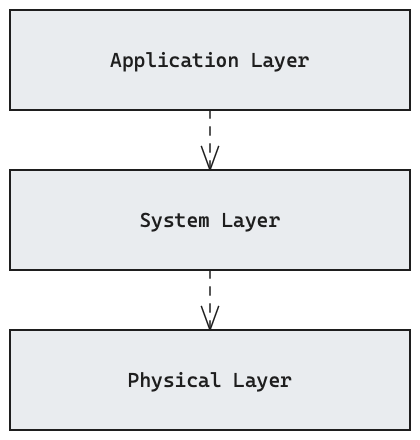
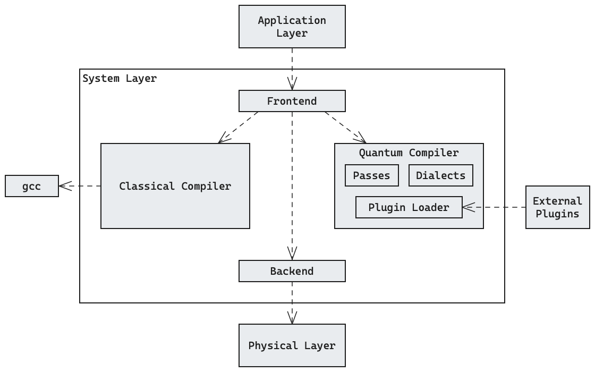

# Building Block View {#section-building-block-view}

## Whitebox Overall System {#_whitebox_overall_system}

<figure markdown="span">
  
</figure>

### Motivation

Quantum software is highly complex, so we use a layered architecture to
decompose such systems into three layers: the application, system, and physical
layer.
We rectify this decision with the following three perspectives:

- **Abstraction:** Software in the application layer is implemented on a high
  level and independently from concrete quantum devices.
  The system layer compiles high-level specifications into device-specific
  instructions and software in the physical layer targets specific devices with
  low-level control.
- **Skills**: Developing software for the application layer requires abstract
  knowledge of quantum computing (e.g. the circuit model) but no understanding
  of its physical implementations is required.
  For working on the system layer, developers need to have a broad understanding
  of various quantum device architectures and
  [deployment concerns](./07_deployment_view.md).
  Detailed knowledge for concrete quantum devices is required to program and
  operate quantum backends in the physical layer.
- **Operation**: In the application layer, manual programming or specification for
  individual use cases is required.
  Compilation in the system layer is mostly automated with only high-level
  compilation settings needing to be configured.
  Execution on the physical layer is fully automated.

### Contained Building Blocks

#### Application Layer
This layer will involve use-case-specific quantum and hybrid programs, written
in high-level languages using algorithms, SDKs and libraries.

<!-- *\<Interface(s)\>* -->

##### Quality Characteristics

- The architecture layer must be extensible for new algorithms and abstractions.

!!! warning "TODO"
    
    These characteristics are not measurable yet and do not set a target value!

#### System Layer
The system layer is responsible for compiling high-level program specifications
from the application layer to low-level, device-specific instructions to be
executed in the physical layer, taking into account the quantum device
architecture (e.g. superconducting vs. neutral atom, topology / connectivity)
and possibly HPC concerns.

##### Quality Characteristics

- The physical layer must be extensible for new quantum device architectures.
- The physical layer must be extensible for new quantum compilation passes.
- The physical layer should be extensible to work with different intermediate
  representations.
- The physical layer should minimise execution cost by optimising generated
  instructions.

#### Physical Layer
The physical layer executes the programs it receives from the system layers by
controlling the physical quantum device.
It is also responsible for calibrating the device and monitoring it (e.g.
fidelities).

##### Quality Characteristics
- The classical co-processor must be able to run decoders in real-time.

### Important Interfaces

!!! warning "TODO"
    
    The interfaces are still to be determined.
    The interface between the application and system layer will involve some
    form of program specification (e.g. source code, circuits or MLIR
    representations) as well as some compiler configuration (e.g. whether to use
    error correction or which quantum device to target) and result passing (e.g.
    callbacks or return values).
    The interface between the system and physical layer will be some low-level
    program specification to be run on quantum devices and co-processors, and it
    involves the reporting of final results as well as monitoring data.

## Level 2 {#_level_2}

!!! info

    The internal architecture of each layer is under the authority of the
    respective team.
    This section shallowly digs into the details the layers nonetheless to give
    an overview of each layer's responsibilities.
    Understanding this separation of concerns is a necessary precondition for
    analysing the interfaces between the layers.

### White Box Application Layer {#_white_box_app_layer}

*\<white box template\>*

### White Box System Layer {#_white_box_sys_layer}

<figure markdown="span">
  
</figure>

#### Motivation
The compiler is split into a quantum and a classical compiler to allow re-using
existing, highly-optimised compiler infrastructure such as gcc while giving
emphasis to extensibility in quantum compilation through a plugin system.
The plugin system also allows integrating proprietary extensions to the
compiler.

#### Contained Building Blocks

- **Frontend:** Used as a facade; shields the core of the compiler from the
  details of the application layer.
  Frontend is to be understood as a programming language frontend for the
  compiler (cf.
  [`gcc`'s page on frontends](https://gcc.gnu.org/frontends.html)), meaning
  frontends for different languages or SDKs could be integrated in the future.
- **Classical Compiler:** Integrates established compiler infrastructure (e.g.
  [`gcc`](https://gcc.gnu.org)) to compile classical parts of the program with
  state-of-the-art optimisations.
- **Quantum Compiler:** Compiles high-level specifications of [quantum-kernels](./12_glossary.md#quantum-kernel) to
  low-level, device-specific instructions.
  The compilation process involves passes and dialects and it is extensible
  through a plugin system.
- **Backend:** The backend is a bridge between the compiler and the physical
  layer.

#### Important Interfaces
!!! warning "TODO"

### White Box Physical Layer {#_white_box_phys_layer}

*\<white box template\>*
