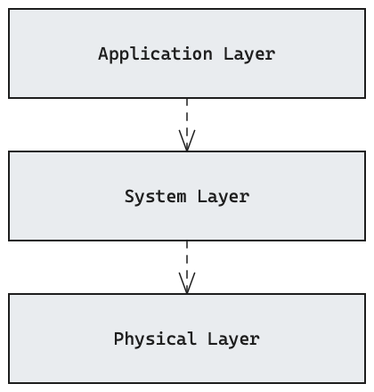
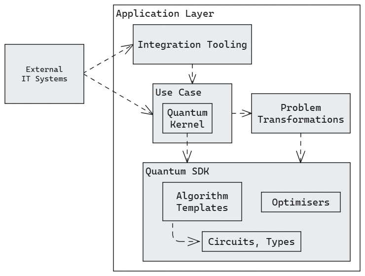
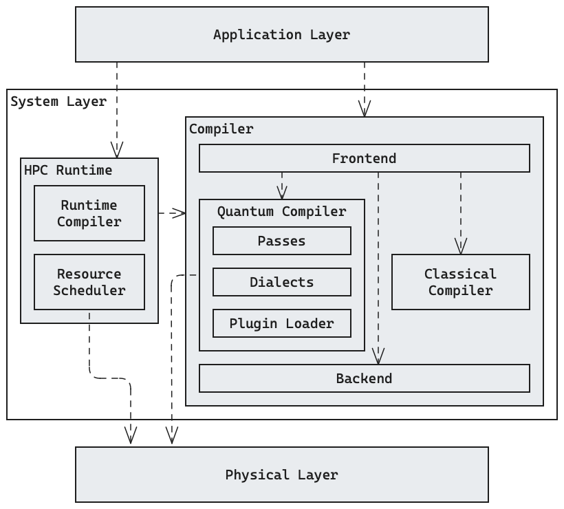
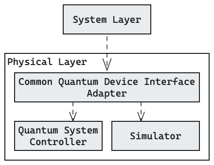

# Building Block View {#section-building-block-view}

## Whitebox Overall System {#_whitebox_overall_system}

<figure markdown="span">
  
</figure>

### Motivation

Quantum software is highly complex, so we use a layered architecture to
decompose such systems into three layers: the application, system, and physical
layer.
We rectify this decision with the following three perspectives:

- **Abstraction:** Software in the application layer is implemented on a high
  level and independently from concrete quantum devices.
  The system layer compiles high-level specifications into device-specific
  instructions and software in the physical layer targets specific devices with
  low-level control.
- **Skills**: Developing software for the application layer requires abstract
  knowledge of quantum computing (e.g. the circuit model) but no understanding
  of its physical implementations is required.
  For working on the system layer, developers need to have a broad understanding
  of various quantum device architectures and
  [deployment concerns](./07_deployment_view.md).
  Detailed knowledge for concrete quantum devices is required to program and
  operate quantum backends in the physical layer.
- **Operation**: In the application layer, manual programming or specification for
  individual use cases is required.
  Compilation in the system layer is mostly automated with only high-level
  compilation settings needing to be configured.
  Execution on the physical layer is fully automated.

### Contained Building Blocks

#### Application Layer
This layer will involve use-case-specific quantum and hybrid programs, written
in high-level languages using algorithms, SDKs and libraries.

<!-- *\<Interface(s)\>* -->

##### Quality Characteristics

- The architecture layer must be extensible for new algorithms and abstractions.

##### See also
* [Whitebox view of the Application Layer](#_white_box_app_layer)

#### System Layer
The system layer is responsible for compiling high-level program specifications
from the application layer to low-level, device-specific instructions to be
executed in the physical layer, taking into account the quantum device
architecture (e.g. superconducting vs. neutral atom, topology / connectivity)
and possibly HPC concerns.

##### Quality Characteristics

- The physical layer must be extensible for new quantum device architectures.
- The physical layer must be extensible for new quantum compilation passes.
- The physical layer should be extensible to work with different intermediate
  representations.
- The physical layer should minimise execution cost by optimising generated
  instructions.

##### See also
* [Whitebox view of the System Layer](#_white_box_sys_layer)

#### Physical Layer
The physical layer executes the programs it receives from the system layers by
controlling the physical quantum device.
It is also responsible for calibrating the device and monitoring it (e.g.
fidelities).

##### Quality Characteristics
- The classical co-processor must be able to run decoders in real-time.

##### See also
* [Whitebox view of the Physical Layer](#_white_box_phys_layer)

### Important Interfaces
#### Between the Application and System Layers
The interface between the Application and System Layers needs to serve the
following needs:

* It needs to transmit program specifications from the Application Layer to the
  System layer.
  In the short term, low-level representations like OpenQASM or Qrisp's
  intermediate representation format will suffice but in the long term, programs
  written in high-level quantum programming languages (like
  [QPI](https://doi.org/10.1109/QCE60285.2024.10293)) will be transmitted,
  represented as their source code.
* It needs to allow submitting program specification for compilation and
  execution with suitable options available for configuring the compiler.
  Furthermore, the progress and results of execution and compilation tasks
  should be reported back to the Application layer.

In the reference implementation, this interface will at first be realised with
[Qrisp's MLIR interface](https://qrisp.eu/reference/Jasp/MLIR%20Interface.html)
which currently supports low-level states and operations but is intended to capture Qrisp's [high-level features](https://qrisp.eu/index.html#key-features)
at some point.
The concrete interface for submitting compilation and execution jobs is yet to
be determined.

#### Between the System and Physical Layers
The interface between the System and Physical Layers needs to serve the
following needs:

* It needs to allow the System Layer to submit low-level quantum program
  specifications to the Physical Layer.
* It needs to allow the System Layer to query properties (like hardware
  architecture, instruction set, topology or gate fidelities) of the quantum
  device managed by the system layer. 

In the reference implementation, the
[Quantum Device Management Interface (QDMI)](https://munich-quantum-software-stack.github.io/QDMI/)
will be used as its
[Job and Query interfaces](https://munich-quantum-software-stack.github.io/QDMI/latest/md_docs_2rationale.html)
satisfy these needs exactly.

## Level 2 {#_level_2}

!!! info

    The internal architecture of each layer is under the authority of the
    respective team.
    This section shallowly digs into the details the layers nonetheless to give
    an overview of each layer's responsibilities.
    Understanding this separation of concerns is a necessary precondition for
    analysing the interfaces between the layers.

### White Box Application Layer {#_white_box_app_layer}

<figure markdown="span">
  
</figure>

#### Motivation

A lot of different software components exist that can be classified as part of
the application layer and the above figure presents a rough sketch of their
dependencies.
Most quantum software that is freely available today makes use of (usually
python-based) SDKs to build quantum circuits.
Furthermore, many tools exist for transforming various scientific, engineering
and commercial problems into quantum formulations, and there exist several tools
for configuring these transformations in a low-code manner.
Fully developed quantum solutions will likely have to implement a custom
component in the long term to interface between existing systems and the quantum
software stack.

#### Contained Building Blocks

- **Use Case:** This component encapsulates the configuration of the quantum
  software stack for a specific use case.
  It is also responsible for interfacing with external IT systems if the quantum
  application is to be integrated into an existing IT system (see [context section](./03_context_and_scope.md)).
  As the Use Case component characterises the interface between quantum and
  classical computation, it will have one or more dedicated
  [**Quantum Kernels**](./12_glossary.md#quantum-kernel) which encapsulate the
  parts of the program that are to be run on a quantum computer. 
  Use case components are highly specific for the context and task they are used
  in.
  Reusable code will often live in the Quantum SDK or Problem Transformation
  libraries.
    - **Integration Tooling**: Some tools specifically target the task of
      integrating quantum applications into existing IT infrastructure.
      This includes for example workflow modeling tools (e.g. with the
      [Kipu Quantum Hub](https://docs.hub.kipu-quantum.com)) and problem
      decomposition tools (e.g. with the
      [ProvideQ Toolbox](https://tva.kastel.kit.edu/english/research_177.php))
      which improve the accessibility of quantum computing and provide
      standardised web APIs which can be integrated into typical IT infrastructure
      more easily.
      Integration tools typically depend on Use Case implementations which they
      wrap with their own abstractions and interfaces but they can also take a
      more fine-grained approach and provide direct access to the Problem
      Transformation and Quantum SDK building blocks. 
- **Problem Transformations:** This component is symbolic for the many
  available tools for transforming scientific, engineering and commercial
  problems into quantum formulations (e.g.
  [qubovert](https://qubovert.readthedocs.io/en/latest/),
  [Qiskit Finance](https://github.com/qiskit-community/qiskit-finance)).
  Many of these tools directly use the Quantum SDK's building blocks.
- **Quantum SDK:** The quantum SDK contains common building blocks for quantum
  software such as circuits and types (e.g.
  [qrisp's quantum variables](https://qrisp.eu/reference/Core/index.html#quantumvariable)),
  algorithm templates (e.g. VQE, QAOA, QPE) and optimisers (e.g. Adam or
  Rotosolve) for hybrid algorithms.
  Popular examples for quantum SDKs include [Eclipse's qrisp](https://qrisp.eu),
  [IBM's Qiskit](https://github.com/Qiskit/qiskit) and
  [Xanadu's Pennylane](https://pennylane.ai).

#### Important Interfaces
We have described the building blocks merely through an abstract
characterisation above, and we will characterise the interfaces between them in
a similar fashion:

* One major interface is the Quantum SDK, the language that developers use to
  specify their quantum applications, and therefore, Use Case implementations,
  Problem Transformations and some Integration Tooling may depend on the chosen
  Quantum SDK.
  The [2025 Quantum Open Source Survey](https://unitaryfoundation.github.io/survey-2025/#Software)
  shows that there is currently no single favourite among the available
  Quantum SDKs, so to facilitate adoption of a standardised quantum software
  stack, it will be important to build integrations of multiple popular SDKs
  into the rest of the stack.
<!-- TODO: quantum sdk to sys layer -->
* Use Case implementations and Problem Transformations provide highly individual
  interfaces since the problems they accept depend on their purpose.
* Integration Tooling can provide access to the Use Case implementations and
  Problem Transformations with a unified interfaces (e.g. for progress updates
  and configuration) but the data/payload types for the submitted problem
  instances are still specific to the Use Case implementation and Problem Transformation which they wrap. 

### White Box System Layer {#_white_box_sys_layer}

<figure markdown="span">
  
</figure>

#### Motivation
The main task of the system layer is compile translate high-level quantum
program specifications into low-level programs that can be executed on physical
quantum hardware.
Furthermore, the system layer also covers the integration into high-performance
computing (HPC) systems.
These two responsibilities are realised through separate building blocks:
the **HPC Runtime** component and the **Compiler** component.

#### Contained Building Blocks

- **HPC Runtime:** This component covers the integration of quantum and hybrid
  programs into HPC systems.
  It includes the following components:
    - The **Runtime Compiler** is based on the full Compiler component
      but focuses on compilation tasks which must be done during the runtime of a
      quantum HPC workload (e.g. re-optimising circuits instructions for changing
      properties of the hardware such as gate fidelities).
    - A specialised **Resource Scheduler** might be necessary to allow the HPC
      system to take into account QPU resources.
- **Compiler:** The purpose of a hybrid quantum compiler is to translate the
  high-level program specification from the application to low-level
  instructions executable on the physical layer.
  It includes the following sub-components:
  It includes a **Frontend** that acts as a facade to the compiler that parses a
  some program specification format (e.g. source code or an intermediate
  representation), splits it into a classical and a
  [quantum kernel](./12_glossary.md#quantum-kernel), and calls the classical and
  quantum compiler with these kernels, respecitvely.
    - **Frontend:** A frontend acts as a facade to the compiler that parses some
      program specification format (such as source code or an intermediate
      representation, splits it into a classical and a
      [quantum kernel](./12_glossary.md#quantum-kernel), and calls the classical
      and quantum compiler with these kernels, respectively.
      The term "frontend" is to be understood as a programming language frontend
      for the compiler (cf.
      [`gcc`'s page on frontends](https://gcc.gnu.org/frontends.html)), meaning
      frontends for different languages or SDKs could be integrated in the future.
    - **Classical Compiler:** Integrates established compiler infrastructure (e.g.
      [`gcc`](https://gcc.gnu.org)) to compile classical parts of the program with
      state-of-the-art optimisations.
    - **Quantum Compiler:** Compiles high-level specifications of [quantum-kernels](./12_glossary.md#quantum-kernel) to
      low-level, device-specific instructions.
      The compilation process involves passes and dialects and it is extensible
      through a plugin system.
    - **Backend:** The backend is a bridge between the compiler and the physical
      layer.

#### Important Interfaces

- As discussed in the interfaces section for the
  [overall system](#_whitebox_overall_system), the interface between the
  application needs to allow submitting program specifications for compilation
  and execution.
  There might be different formats (i.e. languages) for high-level program
  specifications and the compiler will be able to handle different formats
  through multiple frontend components, one for each format.
- The [overall system](#_whitebox_overall_system) interface section also
  discussed that the interface between the system and physical layer needs to
  allow querying device characteristics and submitting jobs.
  These capabilities are needed by the quantum compiler (for device-specific
  compilation) and resource scheduler (for job submission and resource
  allocation), respectively.
- Another important interface will be the plugin interface of the quantum
  compiler which will allow for proprietary extensions of the compilation task
  to contribute compilation passes or dialects.
- The remaining interfaces in the system layer are internal.

### White Box Physical Layer {#_white_box_phys_layer}

<figure markdown="span">
  
</figure>

#### Motivation
The implementation of the physical layer will usually depend on the hardware
architecture and vendor.
As such, the key architectural characteristic here is to either have the vendor
implement our interface towards the system layer, or to implement an adapter
that translates our interface to the vendor's interface.

#### Contained Building Blocks
* **QDMI Adapter:** This component provides the quantum device's characteristics
  via QDMI and acts as an adapter between the QDMI protocol and the
  device-specific Quantum System Controller.
* **Quantum System Controller:** This component controls the physical quantum
  device, for example triggering lasers and sensors in superconducting hardware.

#### Important Interfaces
!!! warning "TODO"
