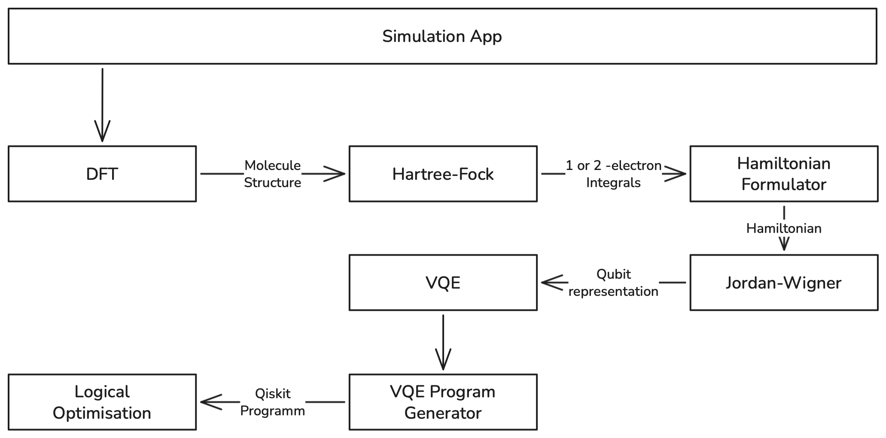

# Runtime View {#section-runtime-view}

!!! note "Architecture Note Scenarios"

        - An architecture must work for its use cases
            - Scenarios can be used to test architectural decisions
            - Representative scenario selection is crucial

In their work, Carbonelli et al. examine three specific industrial use cases.
First, they investigate the use of quantum cloud services to solve optimization problems.
Second, they analyze the potential of quantum simulations in the fields of materials science, chemistry, and physics.
As a third aspect, the authors explore embedded quantum computing with regard to non-functional properties.
These three use-cases will be analyzed in this chapter.

## Quantum simulation for material science, chemistry and physics {#_runtime_scenario_1}

This scenario descriebes the how quatum computing can be used for material science, chemistry and physics. 

It has the following specifications:
-  Input: molecule or atom specification
-  Output: ground state energy, excited states, dipole moments, …
-  Used in: material science, battery design, catalyst research, …

### Application Layer

<figure markdown="span">
  
</figure>

1. Siumaltion App: 
2. DFT (Density Functional Theory): 
    - Function: Calculates the electronic structure of the molecule based on the spatial distribution of electrons (electron density) rather than the complex wave function (as in Hartree-Fock). Within the quantum pipeline, DFT often provides superior starting orbitals (Kohn-Sham orbitals) for the Hamiltonian Formulator.
    - Input: Molecular geometry (atomic coordinates, elements), basis set, a selected "functional" (the mathematical approximation, e.g., B3LYP), charge, and spin.
    - Output: Electron density, optimized molecular orbitals, one- and two-electron integrals, and classically calculated ground-state energy.
3. Hartree-Fock: 
    - Function: Performs a classical approximation calculation to estimate a molecule's ground-state energy and determine its molecular orbitals. It serves as a starting point for more accurate quantum algorithms.
    - Input: Molecular geometry (atomic coordinates, elements), basis set, charge, and spin.
    - Output: Molecular orbitals, one- and two-electron integrals, classical ground-state energy.
4. Hamiltonian Formulator:
    - Function: Takes the results of the Hartree-Fock calculation and formulates the system quantum-mechanically using so-called "second quantization."
    - Input: One- and two-electron integrals (from the Hartree-Fock step).
    - Output: A fermionic Hamiltonian (expressed in terms of electron creation and annihilation operators).
5. Jordan-Wigner:
    - Function: Translates the fermionic Hamiltonian into the language of quantum computing. Electrons (fermions) are mathematically mapped onto qubits.
    - Input: Fermionic Hamiltonian (from the Hamiltonian Formulator)
    - Output: Qubit Hamiltonian (a sum of Pauli matrices or Pauli strings such as X, Y, and Z).
6. VQE (Variational Quantum Eigensolver): 
    - Function: The core algorithm (hybrid: quantum-classical). The quantum computer measures the energy of a specific state, and a classical computer adjusts the parameters to minimize this energy until the true ground state is found.
    - Input: Qubit Hamiltonian, a parameterized quantum circuit (ansatz), and a classical optimization algorithm.
    - Output: The calculated ground-state energy of the molecule and the optimal parameters for the circuit.
7. VQE Program Generator
    - Function: Constructs the actual parameterized quantum circuit (the "Ansatz") that serves as the trial wavefunction for the VQE algorithm (e.g., UCCSD or a hardware-efficient Ansatz).
    - Input: Number of qubits, system properties (e.g., number of electrons), and the chosen Ansatz strategy.
    -  Output: A parameterized quantum circuit.
8. Logical Optimisation:
    - Function: Simplifies and optimises the generated quantum circuit. It removes redundant operations and adapts the code to the physical limitations of the actual quantum hardware.
    - Input: The unoptimised quantum circuit from the program generator.
    - Output: An optimised, shorter quantum circuit closer to the hardware level (fewer gates, lower susceptibility to errors).

### System Layer
1. Runtimes: (e.g., Qiskit Runtime)
    - Function: The execution environment serving as a bridge between the classical computer and the quantum hardware. It manages job queues, minimizes communication time (latency) during the VQE loop, and often automatically applies error mitigation methods.
    - Input: Optimized quantum circuits, execution parameters (e.g., number of measurements/shots, desired level of error correction).
    - Output: Measurement results (e.g., bitstrings or calculated expectation values) and execution metadata.
2. Transpilation:
Transpilation can be broken down into the following three specific sub-steps at the hardware level:
3. Routing:
    - Function: Adapts the circuit to the physical architecture (topology) of the quantum chip. Since not all qubits are physically connected on real hardware, routing inserts "SWAP gates." These shift quantum information until the qubits required for an operation are positioned directly next to each other.
    - Input: Logical quantum circuit, hardware topology (coupling map—which qubits are connected to which?).
    - Output: A physically compatible quantum circuit (often containing additional SWAP operations).
4. Scheduling / Circuit Optimisation:
    - Function: Compresses the circuit and schedules the exact timing of operations. To minimize errors caused by the short lifespan of qubits (decoherence), unnecessary gates are removed (e.g., two opposing operations that cancel each other out), and independent gates are scheduled to execute in parallel for greater time efficiency. 
    - Input: Routed quantum circuit, hardware calibration data (e.g., duration of individual gates).
    - Output: A time-optimized, compressed, and fully scheduled quantum circuit.
5. Circuit-Command mapping:
    - Function: The lowest-level translation step. Here, theoretical quantum gates (such as X, Y, or CNOT) are translated into the actual physical language of the hardware. The quantum computer does not "understand" gates, but rather precisely timed analog signals (such as microwave or laser pulses).
    - Input: The final, scheduled quantum circuit.
    - Output: Analog pulse sequences (waveforms/pulse schedules) sent directly to the quantum computer's control electronics to physically manipulate the qubits.

### Physical Layer

1. Superconducting Device and Firmware:
    - Function: This is the "brain" of the hardware layer. It converts previously calculated instructions into concrete physical signals and controls operations on the quantum chip.
    - Input: Digital hardware instructions and pulse definitions (from the circuit-command mapping).
    - Output: A "Microwave Signal List" (list of microwave signals) sent to the quantum hardware.
2. Molecule Laser:
    - Function: Executes the actual physical quantum operations. It responds to control signals and physically manipulates the state of the qubits. 
    - Input: "Microwave Signal List" (physical signals from the control electronics).
    - Output: Executes quantum operations and sends a "Status Flag" (a physical feedback signal) to the sensor once the operation/measurement is complete.
3. Energy Sensor:
    - Function: Responsible for the readout process. It measures the final physical state of the qubits at the end of the calculation and translates these quantum states back into classical information (e.g., to determine energy in the VQE algorithm).
    - Input: The "Status Flag" (or physical feedback) directly from the quantum hardware ("Molecule Laser").
    - Output: Classical measurement data (such as bitstrings or energy values) sent back to the classical runtime for further processing.

Ab hier geht es wieder von System Layer hoch:

Transpilation

COBYLA

VQE Program Generator

Zero Noise Extrapolation

Simulation App

Ground state energy

## Quantum Cloud Services {#_runtime_scenario_2}
Quantum Cloud Services for optimisation problems

Hybrider Algorithmus gut

- Solving NP-hard combinatorial optimisation problems
- Input: Max-Cut instance
- Output: Solution or approximation to the Max-Cut instance

- Use cases:
    - Flight-gate assignment in airports
    - Electronic Design Automation
    - Trajectory optimization in air traffic
    - Paint-shop scheduling
    - Planning problems in highly individualised mass production

## Embedded QPU {#_runtime_scenario_3}
Embedded quantum computing for non-functional properties

