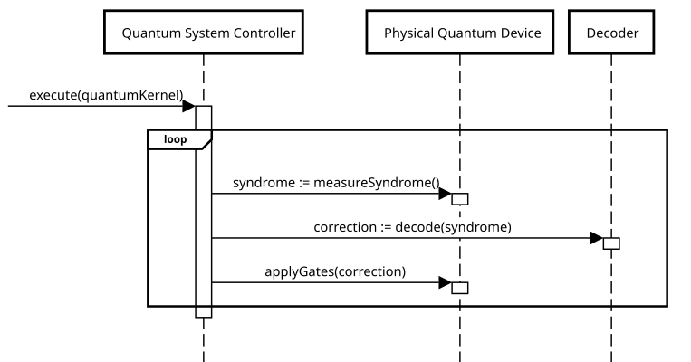

# Runtime View
In the runtime view section, we document behavioural properties between building
blocks and artifacts that are typical for quantum software systems.

!!! info

    Learn more about runtime view documentation for software architecture in the
    [arc42 guide](https://docs.arc42.org/section-6/).

## QEC Decoding Loop {#qec-decoding-loop}
Quantum Error Correction (QEC) will likely play a crucial role in making quantum
computers fault tolerant. <!--TODO: link cross-cutting concerns section once merged--><!--TODO cite-->
To realise QEC in practice, syndrome measurements must be executed, syndromes
must be decoded, and corrections must be applied at a high pace to reduce the
logical error rate effectively[^sparse-blossom].
The decoding loop is executed repeatedly during the execution of the encoded
quantum program, so the syndrome measurements have to be realised as mid-circuit
measurements.

[^sparse-blossom]: Higgott, O. & Gidney, C. [Sparse Blossom: correcting a million errors per core second with minimum-weight matching](https://doi.org/10.22331/q-2025-01-20-1600). Quantum 9, 1600 (2025).

We visualise the decoding loop in the following sequence diagram:
<figure markdown="span">
    {style="max-width: 80%"}
</figure>

---

The runtime view documents the concrete behaviour and interaction of the building blocks. Based on [Carbonelli et al.'s work](https://link.springer.com/content/pdf/10.1007/978-3-031-64136-7_12.pdf), we demonstrate how typical quantum use cases are represented in the architecture. The demonstration shows one scenario in detail for each use case, starting at the user input, continuing through the execution, and concluding with the return value to the user.
We document these steps through an activity diagram, in which each architecture layer is divided by a swim lane.  We focus on the steps and interfaces during the execution process rather than describing the building blocks in detail.

<!---!!! note "Architecture Note Scenarios"

        - An architecture must work for its use cases
            - Scenarios can be used to test architectural decisions
            - Representative scenario selection is crucial -->

## Quantum simulation for material science, chemistry and physics {#_runtime_scenario_1}

This scenario describes the how quantum computing can be used for material science, chemistry and physics. 

It has the following specifications:

-  Input: molecule specification
-  Output: ground state energy
-  Used in:
    - material science
    - battery design
    - catalyst research

  

### Application Layer - Downwards

1. Simulation App:
    - The Simulation App is the entry point for this scenario.
    - It takes the molecule specification and passes it down to the Hartree-Fock algorithm

2. Hartree-Fock:
    - The Hartree-Fock algorithm is the first transformation step to get from the molecule input to a quantum ready representation
    - Its input is the molecular geometry in our scenario
    - The output are the electron integrals.

4. Hamiltonian Formulator:
    - The Hamiltonian formulation maps the electron integrals into a fermonic Hamiltonian.

6. Jordan-Wigner:
    - The Jordan-Wigner Transformation allows a qubit representation using a fermonic Hamiltonian and turns it into a spin Hamiltonian, which is equivalent to a set of qubits.
     
8. VQE (Variational Quantum Eigensolver):
    - The VQE Algorithm is a hybrid algorithm, which uses the qubit Hamiltonian to create a parameterised quantum circuit.

9. VQE Program Generator
    - With the parametrised circuit the program generator creates a program for the transpilation pipeline in the system layer.
 
### System Layer - Downwards

The [Qiskit Transpilation Pipeline](https://quantum.cloud.ibm.com/docs/en/guides/transpile) consists of 6 steps:

1. Initialization Stage
    - Using the quantum program from the Application Layer, the transpilation pipeline can start.
    - The first step of the transpilation pipeline is breaking down multi- and custom made qubit- gates into one- or two-qubit operations.
      
2. Layout Stage
    - This stage maps the input circuit's virtual qubits to the target's physical hardware qubits.
    - Ideally, the algorithm maps the qubit that interact the most next to each other. 
    - While it does not guarantee continuous connectivity or direct execution validity, finding an optimal initial layout is a important, computationally expensive step that minimizes error rates and reduces the need for subsequent routing.

3. Routing Stage
    - As described in the step before, a perfect connectivity between the qubits can not always be achieved. Therefore this stage adds additional operations to adapt to these constraints.
    - Using the circuit and hardware topology as inputs, it can create a physically compatible circuit by inserting SWAP gates to move information between previously disconnected qubits.

4. Translation Stage
    - This stage rewrites all previously chosen gates into the specific native gates supported by the target hardware's Instruction Set Architecture (ISA). 

5. Optimization Stage 
    - This stage executes low-level, hardware-aware refinements on circuits that are already compatible with the target's Instruction Set Architecture (ISA) to reduce redundancy.

6. Scheduling Stage 
    - The scheduling stage receives an ISA-compatible circuit and inserts explicit delay instructions to accurately reflect qubit idle periods, hardware timing constraints and to reduce error rate.
    - It ensures the final output remains ISA-compatible while updating start-time metadata and optionally applying walltime-sensitive transformations.
    - This concludes the Qiskit transpilation pipeline.

7. Circuit-Command Mapping
    - Using the ISA-compatible circuit, additional information like number of measurements demanded and a translation table, which translated the commands into backend compatible commands, this steps gives a list of operations to the device and firmware of the hardware.

### Physical Layer 

1. Superconducting Device and Firmware:
    - Using digital hardware instructions and pulse definitions, this process converts these commands into physical signals to control operations on the quantum chip. 
    - It outputs a Microwave Signal List directly to the quantum hardware, translating digital instructions into executable physical actions.
    
2. Molecule Laser:
    - The Molecule Laser uses the Microwave Signal List to execute the quantum operations on the physical hardware.
    - When all operations are done, the Molecule Laser sends a status flag to the Energy Sensor

3. Energy Sensor:
    - When the Molecule Laser updated its status, this step measures the qubit energy levels 

### System Layer - Upwards 

7. Transpilation
    - In this step, the qubit energy levels are transformed into an expectation value.
    - To do this, additional backend data is needed to interpret the measured results.

### Application Layer - Upwards 

10. COBYLA
    - COBYLA is a classical optimizer which needs an expectation value as input.
    - It compares the expectation value to the last one (if it exists) and tries to optimize the parameters of the VQE algorithm.
    - After an local optimal solution is found or the maximum of iterations is reached, the classical optimizer terminates
      
11. VQE Program Generator
    - The Program Generator updates the parameters of the COBYLA algorithm and starts the process again.
    - When the classical optimizer terminates, the Program Generator gives the optimal result towards the Error Mitigation Method.
      
12. Zero Noise Extrapolation
    - Zero Noise Extrapolation (ZNE) is a error mitigation method, which can reduce the error rate by using an expectation value and a circuit has input
    - It creates a program to measure a new expectation value with a circuit, which has still the same function but uses more gates. 
    - This process is repeated multiple times and lead towards a noise pattern, which allows to reduce the error rate by extrapolation.
    
13. Simulation App
    - The error-optimized expectation value is given towards the simulation app, which then visualize it as ground state energy for the user.

## Quantum Cloud Services {#_runtime_scenario_2}
In this scenario, we want to show how our architecture behaves and interacts using a NP-hard combinatorial optimisation problem. Since the System and Physical Layer are almost identical to the first scenario, we only document the new building blocks. 

  

It has the following specification:

- Input: Max-Cut instance
- Output: A cut consisting of a set of edges
- Used in:
    - Flight-gate assignment in airports
    - Electronic Design Automation
    - Trajectory optimization in air traffic
    - Paint-shop scheduling
    - Planning problems in highly individualised mass production

### Application Layer - Downwards
1. Cloud Optimisation Application:
    - Processes the MaxCut problem instance and forwards the information to the QUBO Transformator

2. QUBO Transformator
    - Creates a QUBO, using the information of the Cloud Optimisation Application

3. Ising Transformator
    - Transforms the QUBO into an Ising Hamiltonian

4. Penalty Encoder
    - Checks if the required optimization problem needs a penalty factor and adjusts it.
     
5. QAOA
    - QAOA is a hybrid algorithm which uses tunable parameters.
    - It encodes the Ising Hamiltonian into a quantum circuit
   
6. QAOA Program Generator
    - With the parametrised circuit the program generator creates a program for the transpilation pipeline in the system layer.
 
### System Layer - Downwards
1. Noise Suppression
    - Noise Supression reduces the error rate by actively canceling noise using clever pulse timing or add redudancy to detect and fix errors.
    - It takes an optimized circuit and adds the above mentioned operations.
   
   
### Physical Layer - Downwards
-- 
### System Layer - Upwards
-- 
### Application Layer - Upwards
7. SPSA
    - Similar to COBYLA, SPSA is classical optimizer used for optimizing the parameters of the QAOA algorithm. 
    - It updates the parameters and sends them to the QAOA Program Generator, where the program is computed again until the optimizer terminates.
   
## Embedded QPU {#_runtime_scenario_3}
In this scenario, we demonstrate an integration of a quantum processing unit (QPU) into a hybrid safety software system with non-functional properties.

  

- Compute the probability of a collision and give it to the executive unit.
- Input: Environment data
- Output: Collision probability
- Used in:
  - autonomous driving
  - drones
 
    
### Application Layer - Downwards
1. Collision Probability App
    - Takes the environment data and forwards the lidar, camera and gps data to the Feature Vector Encoder
   
2. Feature Vector Encoder
    - Encodes a feature vector based on the ionformation of the collision probability app
   
3. Angle Encoder
    - Used the feature vector to create a quantum state, which represents the given information 

4. Quantum Kernel Method
    - The quantum kernel method creates a qiskit program, which can then be forwarded to the system layer
   
### System Layer - Downwards
1. Probabilistic Error Cancellation (PEC_1)
    - Probabilistic Error Cancellation is an error mitigation technique, which reduces the error rate by measuring how much noise each gate creates and creating "ideal", noise-free gates by a combination of the noisy gates. 
    - Run the circuit multiple times, where the gate you replace is randomly chosen.
   
### Physical Layer - Downwards
-- 
### System Layer - Upwards
2. Probabilistic Error Cancellation (PEC_2)
    - In this step, we finish the PEC from before using the combination of all measurements and creating an average.
   
### Application Layer - Upwards
5. Collision Probability App
    - Sends the result to the device/software that requested the job. 

## Collision Detection using Quantum Machine Learning {#_runtime_scenario_4}
This scenario covers how a Quantum Machine Learning (QML) collision detection use case maps to the layers of our architecture.
The figure below depicts the inference process with regular arrows and the training process with additional dotted arrows.

  

- Compute the probability of a collision and decide which action to take
- Input: Real-time Camera Images
- Output: Action
- Used in:
    - autonomous driving
    - drones
 
    
### Application Layer - Downwards
1. Collision Detection App
    - Takes the real-time camera images and forwards the image data to the preprocessing
   
2. Preprocessing
    - Takes the image data as input and performs resizing, rescaling, color conversion, region-of-interest extraction and denoising

3. Residual Network (ResNet)
    - Trained ResNet Backbone uses the image data to extract the features of an image
    - Creates a feature vector and forwards the Principal Component Analysis

4. Principal Component Analysis (PCA)
    - Due to the limitation in the number of qubits, this step reduces the number of features in the feature vector
      
5. Angle Encoding
    - Encodes each feature using rotational gates
    - Creates an encoded quantum state 
   
6. Quantum Neural Network
    - Appends a variational quantum circuit to the encoded quantum state
    - Sends program to the System Layer
      
### System Layer & Physical Layer
Refer to [use case 1](#_runtime_scenario_1) for a full explanation.

### Application Layer - Upwards

7. Softmax Function 
    - Transforms expectation values of each feature into probabilities
    - Gives the Collision Detection App a collision probability
    
8. Cross-Entropy Loss (training only)
    - Calculates the loss of the probabilities of the features
       
10. Backpropagation (training only)
    - Takes in the loss of the features and calculates the loss gradient
      
12. Adaptive Moment Estimation (ADAM) (training only)
    - Uses the loss gradient to optimize the parameter of the quantum neural network.

