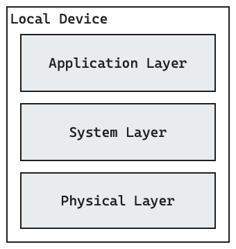
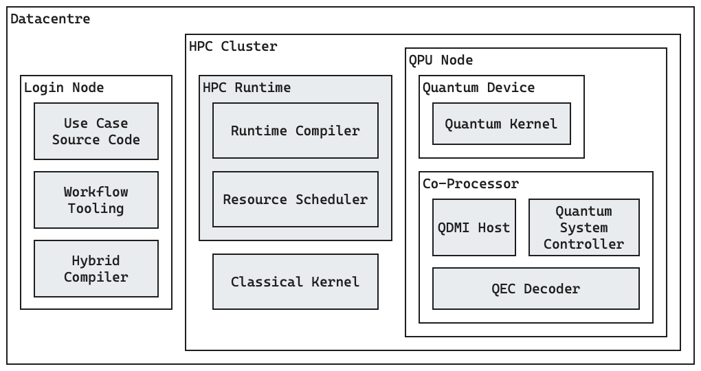

# Deployment View {#section-deployment-view}

Quantum software stacks can be deployed in various environments.
This section documents a few common deployment scenarios.

## Deployment on a Single Machine
<figure markdown="span">
  
</figure>

While developing quantum software, it is common to test the software on a local
machine.
In this most simple scenario, a full instantiation of the quantum software stack
is installed on a single non-quantum device such as a developer's laptop or
server.
As no quantum hardware is available in such a scenario, the physical layer
contains a simulator rather than actual quantum device firmware to execute
quantum kernels.

## Deployment in an HPC Centre
<figure markdown="span">
  
</figure>

It is a common belief in the quantum software community that quantum computers
will be most useful as accelerators in High-Performance Computing (HPC)
datacentres.
A key feature of HPC clusters is that they integrate enormous amounts of
computation resources (such as CPUs, GPUs, and potentially QPUs) to compute
solutions to problems that are otherwise impossible to solve.

For the execution of quantum software in an HPC environment, three execution
environments are particularly important:

* The **Login Node** is a machine that acts as an entry point to the datacentre.
  It allows developers/operators/researchers to bring the *Use Case Source Code*
  to the datacentre, and to generate executables for the *Quantum* and
  *Classical Kernels* from it with the *Hybrid Compiler*.
* The **HPC Cluster** is at the core of the HPC datacentre.
  It is made up of CPUs, accelerators (such as GPUs) and storage facilities that
  allow running large classical workloads such as the *Classical Kernel* that
  was compiled on the login node.
  Beyond the actual workload, the HPC cluster also contains *HPC Runtime*
  components such as the *Runtime Compiler* and the *Resource Scheduler* which
  are responsible for distributing the workfload onto the available resources.
* In a quantum software context, a special device within the HPC Cluster is the
  **QPU Node** which is made up of a physical **Quantum Device** (a.k.a. QPU or
  quantum computer) and a **Co-Processor**.
  The Co-Processor is a classical computer <!-- TODO: or FPGA? --> that runs the
  **firmware** of the Quantum Device so that it can execute the compiled
  *Quantum Kernel*.
  Furthermore, the Co-Processor runs code that requires a low latency or high
  bandwidth to the Quantum Device such as control flow or *QEC Decoder* tasks.
