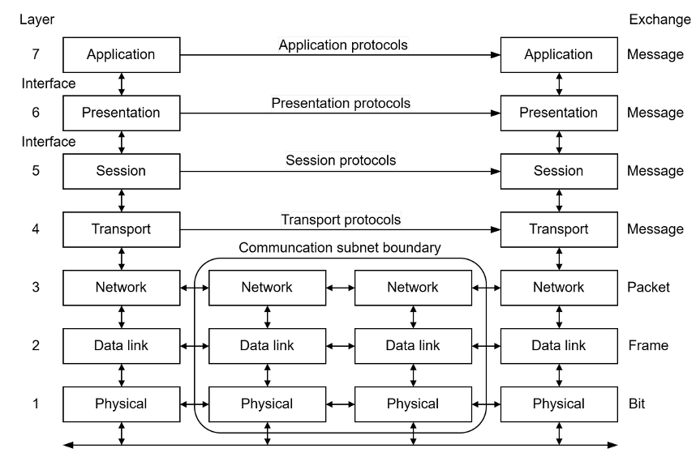
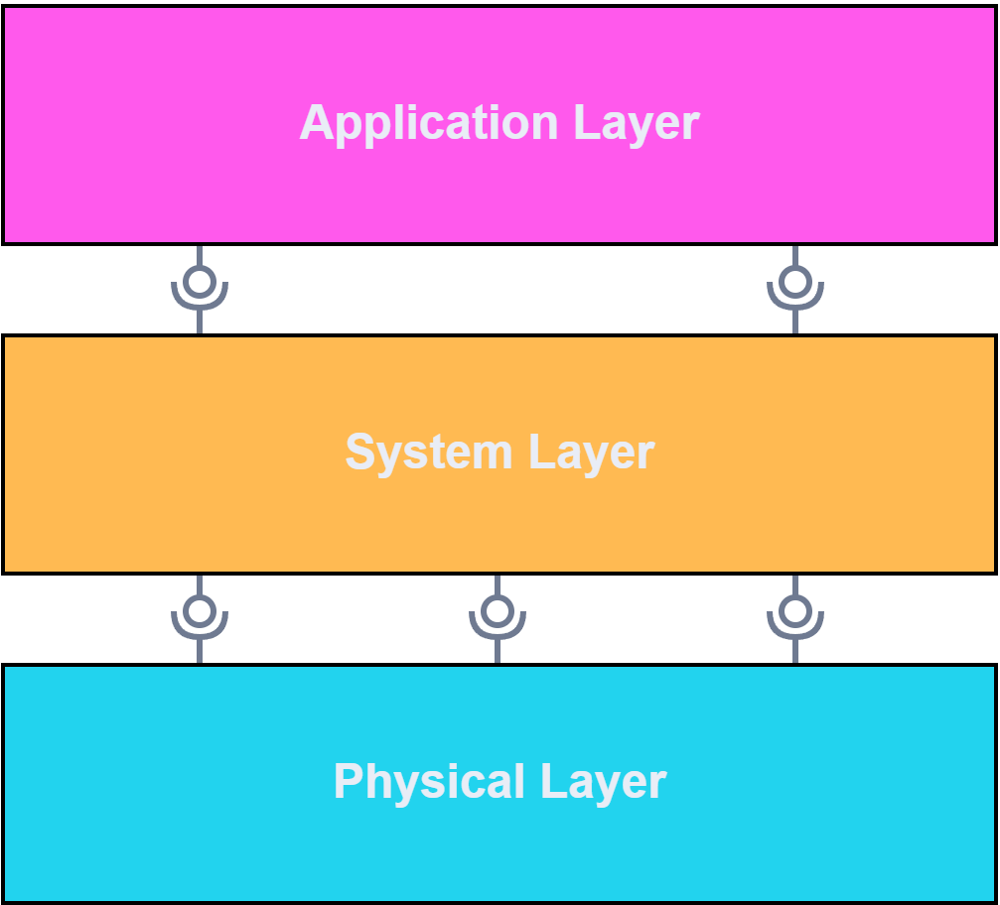

# FullStaQD Reference Architecture
The FullStaQD Reference Architecture provides architectural guidance to address
requirements commonly found in quantum software systems.
Its key goal is to foster interoperability and modularity in quantum software.
As a reference architecture, this project remains on a fairly high level,
describing abstract responsibilities in typical components and interfaces rather
than enforcing the use of specific packages or protocols.
[Reference Implementations](../reference-implementation/) for these abstract
parts are also developed within the FullStaQD project and will be made available
at a later date.

This introductory page provides a brief overview of key elements in the
reference architecture, as well as the methodology which was used to develop
the reference architecture.
More detailed guidance is available in the respective sections of the reference
architecture documentation which can be accessed on the left.
This documentation roughly follows the [arc42](https://arc42.org) architecture
documentation template (v9.0) for section organisation.

!!! tip "Help us improve the reference architecture!"

    The FullStaQD Reference Architecture is designed in the open on GitHub.
    We warmly invite the community to give feedback, to discuss improvements,
    and to collaborate on making it useful for practical use.

    Check out our
    [contribution guide](https://github.com/FullStaQD/architecture/blob/main/CONTRIBUTING.md)
    on GitHub!

!!! info "What is a reference architecture?"

    **Software Architecture:**
    In software engineering, the architecture of a software system describes its
    high-level design.
    Software architectures are ideally designed after researching the
    requirements of the system under design, and before designing the
    fine-grained structure of the system.
    Thinking about the high-level structure of a system early on in its design
    process allows the architect to address *architecturally significant
    requirements* -- such requirements are usually hard or expensive to retrofit
    once the system has been implemented already.
    A typical example for architecturally significant requirements is a
    performance requirement since tight performance bounds can often only be
    achieved with the right technologies (e.g. programming languages or
    databases), and with tight couplings between components that require
    low-latency or high-bandwidth communication.

    **Reference Architecture:**
    A reference architecture adds another level of abstraction compared to
    concrete software architectures.
    It describes the "essence of the architectures of a set of software systems
    of a given domain" and "its purpose is to be a guidance for the development,
    standardization, and evolution of systems."[^nakagawa-refarch-model]
    Reference architectures can be used to describe families or product lines of
    software systems, and here we use it to describe the family of quantum
    software systems.

    **Example:**
    The well-known OSI telecommunications model is a well-known example which
    can be considered a reference architecture.
    It defines seven abstractions layers which characterise a separation of
    concerns in telecommunications without specifying concrete implementations
    for these layers, or concrete protocols between them.
    The OSI model can be *instantiated* to describe WWW systems, for example
    using TCP on the transport layer, SSL on the presentation
    layer, and HTTP on the application layer.
    The reference architecture is abstract enough to be stable w.r.t. changes of
    the concrete protocols (e.g. using a different encryption protocol on the
    presentation layer) yet it is concrete enough to provide a common structure
    to telecommunications systems.

    <figure markdown="span">
        { style="max-width: min(100%, 25rem)" }
        *Visualisation of the OSI model, adapted from Fortier et al.[^fortier-osi-model].*
    </figure>

[^nakagawa-refarch-model]: Nakagawa, E. Y., Oquendo, F. & Becker, M. ["RAModel: A Reference Model for Reference Architectures"](https://doi.org/10.1109/WICSA-ECSA.212.49). 2012 Joint Working IEEE/IFIP Conference on Software Architecture and European Conference on Software Architecture (2012).
[^fortier-osi-model]: Fortier, P. J. & Michel, H. E. ["15 - Analysis of Computer Networks Components"](https://doi.org/10.1016/B978-155558260-9/50015-1), in Computer Systems Performance Evaluation and Prediction (2003).

## Overview
The FullStaQD Reference Architecture uses a three-layered architecture to
structure quantum software systems into different levels of abstraction:

1. Quantum programs are first specified in the **Application Layer** which is
   largely device-independent and offers high-level programming tooling.
2. The **System Layer**'s purpose is to translate these programs into efficient
   low-level representations, taking into account execution environment
   properties both from quantum devices and HPC resources.
3. Quantum programs are executed in the **Physical Layer** which contains
   quantum device firmware or simulators, and adapters exposing the features of 
   those devices under a unified interface.

A detailed breakdown of the components of the layers can be found in the
[building block view](./building-block-view.md).

Not all responsibilities in the quantum software stack can generally be
associated with a single layer, some need to be implemented across layers, like
Fault Tolerance, Monitoring, or Development Tooling.
The [cross-cutting concepts](./cross-cutting-concepts.md) section elaborates on
how to realise these varous cross-cutting concepts.

<figure markdown="span">
    { style="max-width: min(100%, 20rem)" }
    <figcaption>
        A visualisation of the reference architecture's three layers:
        Application Layer, System Layer, and Physical Layer
    </figcaption>
</figure>

## Quality Requirements Overview
The architectural decisions taken in the FullStaQD Reference Architecture are
driven by the quality requirements typically found in quantum software systems.
The following list is a summary of the most significant quality requirements;
the full list can be found in the
[quality requirements](./quality-requirements.md) section.

| Quality Requirement { style="width: 1%; white-space: nowrap;" } | Description | 
| ------------- | ------------- | 
| [Extensibility](./quality-requirements.md#extensibility) | Quantum software systems can be extended with new use cases, SDKs, compiler passes, fault tolerance measures, and quantum devices. |
| [Integrability](./quality-requirements.md#integrability) | Quantum software systems can be integrated into existing IT infrastructure, and High-Performance-Computing systems in particular. |
| [Modularity](./quality-requirements.md#modularity) | Changes to one component should not affect other components. |
| [Fault Tolerance](./quality-requirements.md#fault-tolerance) | The quantum software system can produce correct results in the presence of noise. |
| [Maintainability](./quality-requirements.md#maintainability) | The reference architecture can be modified, corrected, adapted or improved due to changes in the environment or requirements with ease. |

## Stakeholders {#stakeholders}
Quantum software systems are developed and used by stakeholders with different
motives, interests and constraints.
These forces influence the design of software systems, and software architecture
in particular.
For example, stakeholders can demand different levels of abstractions:
Business users of quantum software benefit from a high level of abstraction to
inform their decisions whereas quantum firmware developers need access to all
technical details.

Schmidbauer et al.[^stakeholder-personas-ref] present the following persona
hypothesis, that is a characterisation of the typical stakeholders in quantum
software:

| Category | Stakeholders |
|-|-|
| *Application-oriented* | business user, early adopter, government contractor |
| *Application- and hardware-oriented* | simulation-focused engineer, researcher |
| *Hardware-oriented* | platform builder, quantum algorithm designer, HPC engineer, embedded quantum developer |

In the FullStaQD Reference Architecture, we keep stakeholders in mind throughout
the architecture design.
Most prominently, the reference architecture uses a
[three-layered architecture](./building-block-view.md) to offer different levels
of abstraction to different stakeholders. 

??? info "More about stakeholders"

    More info on documenting stakeholders can be found in the
    [arc42 docs](https://docs.arc42.org/section-1/#13-stakeholder).
    For a recent study on stakeholders in quantum software, check out the
    ["Know You Qubits, Know Your Users: Personas for Quantum Software"][stakeholder-personas-link]
    paper by Schmidbauer et al..

[^stakeholder-personas-ref]: Schmidbauer, L. ["Know You Qubits, Know Your Users: Personas for Quantum Software"][stakeholder-personas-link]. Preprint on arXiv (2026).

[stakeholder-personas-link]: https://arxiv.org/abs/2608.18598

## Methodology  
To fulfill the requirements and goals of the reference architecture, we consider several key aspects that are fundamental to the design of modern software architectures:

- the multitude of perspective of stakeholders and use cases
- the multitude of abstractions, where most expertise of stakeholders focuses only a specified area
- the multitude of languages, which are used by the different domain experts  (physicists, software-engineers, mathematicians, ...)
- the rapid advancement in the quantum eco system

To address these aspects and continuously validate and refine the reference architecture, we employ a set of state-of-the-art methods from classical software engineering:
 <!--  Hier könnte man Paper oder Ergebnisse hinten noch als Spalte in Zukunft Verlinken -->
| Method  | Description | Reason | 
| ------------- | ------------- | ------------- | 
| [Scenario-Based Analysis](../scenario-based-analysis)| Using predefined scenarios of use cases on the reference architecture  | To assess how well the reference architecture covers the predefined scenarios and to identify the common requirements shared by the components on which those scenarios depend.  |
| Requirement Survey  | Sending surveys to stakeholders asking for requirements and needs for their components | Obtaining high-level input on the requirements that the reference architecture must fulfill  |
| Interview with Stakeholders  | In-depth interviews with stakeholders about the reference architecture and their respective positions  | Acquiring detailed insights of Stakeholders and adopt their input  |
| Workshops  | Regular on-site exchange with the consortium  | Updating partners of current status and discussing next steps |
| Community Engagement | Allowing open requests and discussion about the reference architecture through our ticket system | Ensuring external input, extendability and exchangability | 
