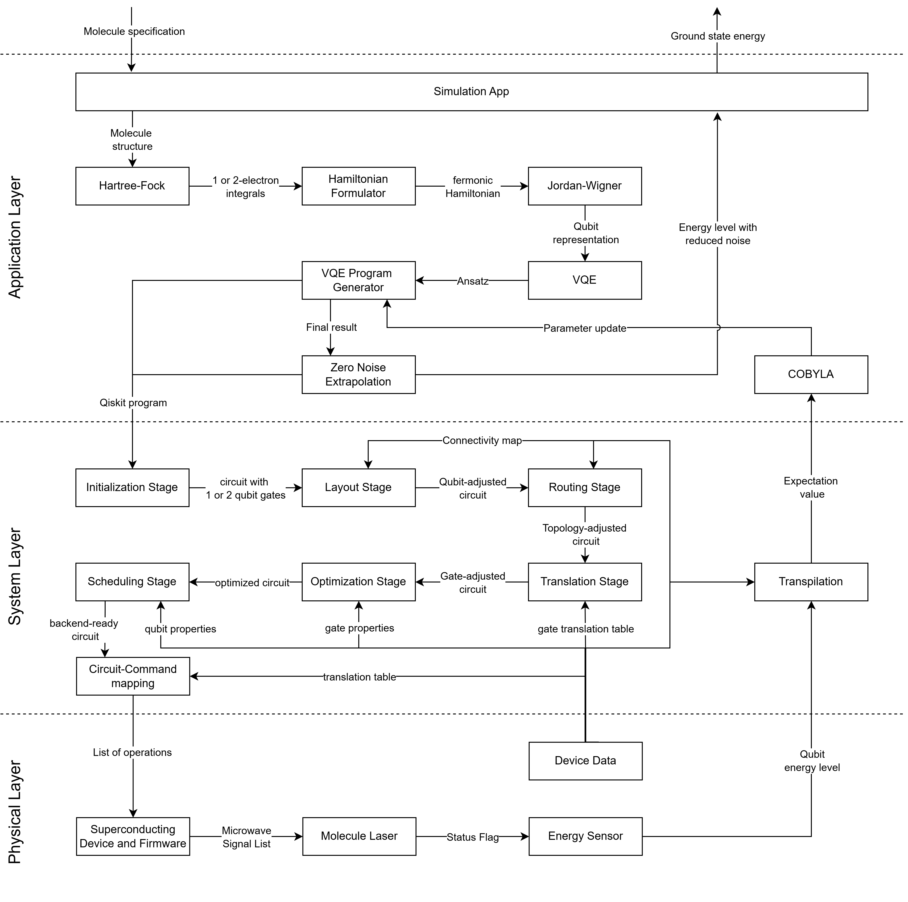

# Runtime View
In the runtime view section, we document behavioural properties between building
blocks and artifacts that are typical for quantum software systems.

!!! info

    Learn more about runtime view documentation for software architecture in the
    [arc42 guide](https://docs.arc42.org/section-6/).

## QEC Decoding Loop {#qec-decoding-loop}
Quantum Error Correction (QEC) will likely play a crucial role in making quantum
computers fault tolerant. <!--TODO: link cross-cutting concerns section once merged--><!--TODO cite-->
To realise QEC in practice, syndrome measurements must be executed, syndromes
must be decoded, and corrections must be applied at a high pace to reduce the
logical error rate effectively[^sparse-blossom].
The decoding loop is executed repeatedly during the execution of the encoded
quantum program, so the syndrome measurements have to be realised as mid-circuit
measurements.

[^sparse-blossom]: Higgott, O. & Gidney, C. [Sparse Blossom: correcting a million errors per core second with minimum-weight matching](https://doi.org/10.22331/q-2025-01-20-1600). Quantum 9, 1600 (2025).

We visualise the decoding loop in the following sequence diagram:
<figure markdown="span">
    {style="max-width: 80%"}
</figure>

## A Full-Stack Example
Here we visualise a concrete example from our scenario-based analysis <!-- TODO: link SBA part once #41 is merged -->
to illustrate what's involved in the full-stack execution of a quantum software
application.
This scenario covers an application in material simulation, check out the
[scenario's documentation](#_runtime_scenario_1) for the details. <!-- TODO: update link when #41 is merged -->

!!! warning "A common misconception"

    Note that this diagram does not characterise any deployment properties.
    For example, the VQE algorithm and COBYLA optimiser depicted in the
    application layer do not necessarily have to be executed in a python
    environment and could also be compiled to be executed in a cloud,
    high-performance, or other runtime environment.
    See [Deployment View](./07_deployment_view.md) for deployment concerns.

<figure markdown="span">
    {style="max-width: 95%"}
</figure>
