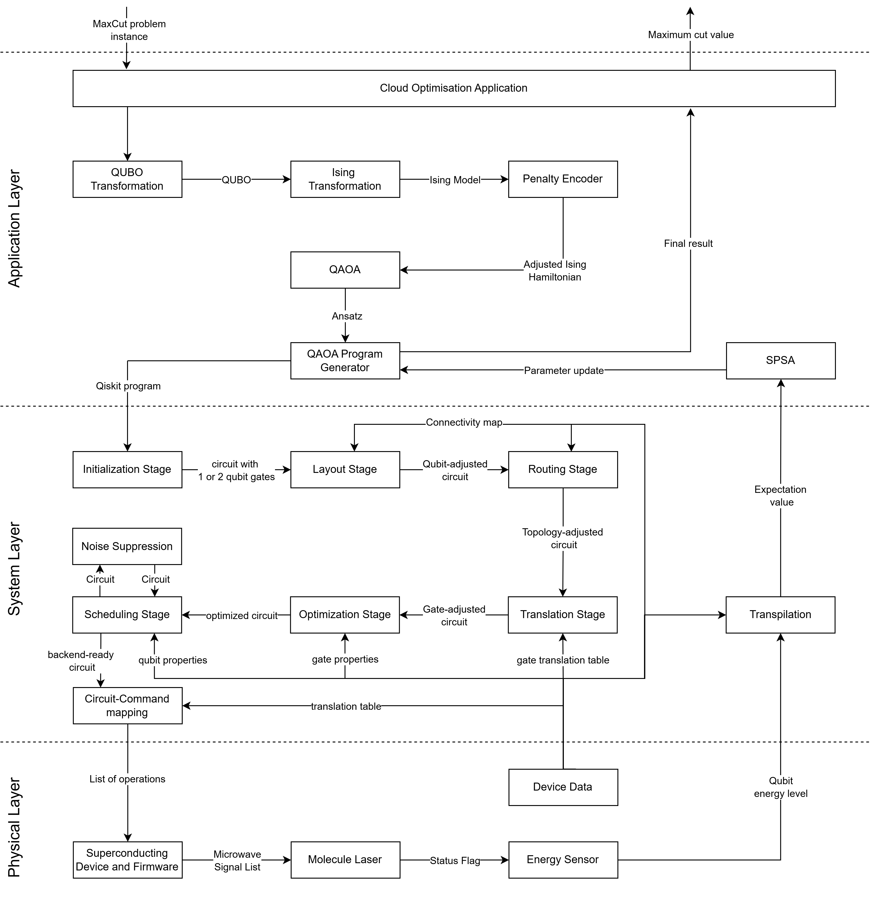

# Quantum Cloud Services for Optimisation Problems
In this scenario, we want to show how our architecture behaves and interacts using a NP-hard combinatorial optimisation problem. Since the System and Physical Layer are almost identical to the first scenario, we only document the new building blocks. 

  

It has the following specification:

- Input: Max-Cut instance
- Output: A cut consisting of a set of edges
- Used in:
    - Flight-gate assignment in airports
    - Electronic Design Automation
    - Trajectory optimization in air traffic
    - Paint-shop scheduling
    - Planning problems in highly individualised mass production

## Application Layer - Downwards
1. Cloud Optimisation Application:
    - Processes the MaxCut problem instance and forwards the information to the QUBO Transformator

2. QUBO Transformator
    - Creates a QUBO, using the information of the Cloud Optimisation Application

3. Ising Transformator
    - Transforms the QUBO into an Ising Hamiltonian

4. Penalty Encoder
    - Checks if the required optimization problem needs a penalty factor and adjusts it.
     
5. QAOA
    - QAOA is a hybrid algorithm which uses tunable parameters.
    - It encodes the Ising Hamiltonian into a quantum circuit
   
6. QAOA Program Generator
    - With the parametrised circuit the program generator creates a program for the transpilation pipeline in the system layer.
 
## System Layer - Downwards
1. Noise Suppression
    - Noise Supression reduces the error rate by actively canceling noise using clever pulse timing or add redudancy to detect and fix errors.
    - It takes an optimized circuit and adds the above mentioned operations.
   
   
## Physical Layer - Downwards
-- 
## System Layer - Upwards
-- 
## Application Layer - Upwards
7. SPSA
    - Similar to COBYLA, SPSA is classical optimizer used for optimizing the parameters of the QAOA algorithm. 
    - It updates the parameters and sends them to the QAOA Program Generator, where the program is computed again until the optimizer terminates.
