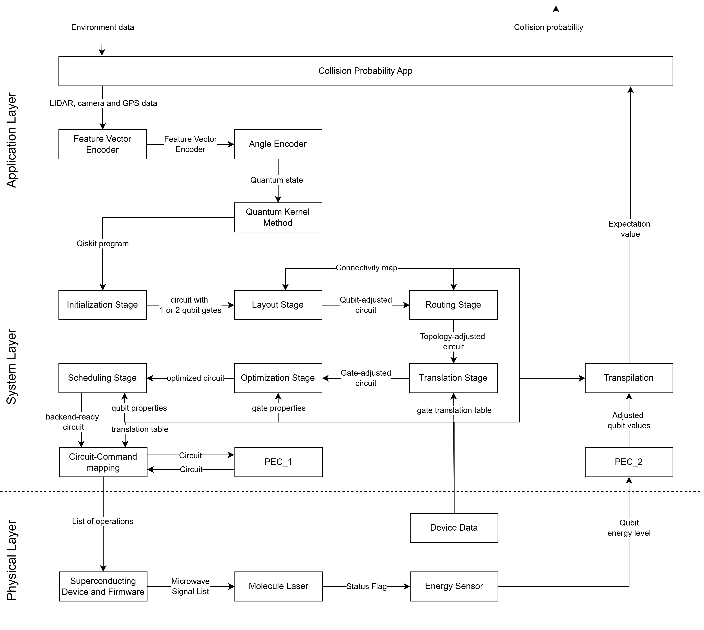

# Collision Detection with an Embedded QPU
In this scenario, we demonstrate an integration of a quantum processing unit (QPU) into a hybrid safety software system with non-functional properties.

  

- Compute the probability of a collision and give it to the executive unit.
- Input: Environment data
- Output: Collision probability
- Used in:
  - autonomous driving
  - drones
 
    
## Application Layer - Downwards
1. Collision Probability App
    - Takes the environment data and forwards the lidar, camera and gps data to the Feature Vector Encoder
   
2. Feature Vector Encoder
    - Encodes a feature vector based on the ionformation of the collision probability app
   
3. Angle Encoder
    - Used the feature vector to create a quantum state, which represents the given information 

4. Quantum Kernel Method
    - The quantum kernel method creates a qiskit program, which can then be forwarded to the system layer
   
## System Layer - Downwards
1. Probabilistic Error Cancellation (PEC_1)
    - Probabilistic Error Cancellation is an error mitigation technique, which reduces the error rate by measuring how much noise each gate creates and creating "ideal", noise-free gates by a combination of the noisy gates. 
    - Run the circuit multiple times, where the gate you replace is randomly chosen.
   
## Physical Layer - Downwards
-- 
## System Layer - Upwards
2. Probabilistic Error Cancellation (PEC_2)
    - In this step, we finish the PEC from before using the combination of all measurements and creating an average.
   
## Application Layer - Upwards
5. Collision Probability App
    - Sends the result to the device/software that requested the job. 
