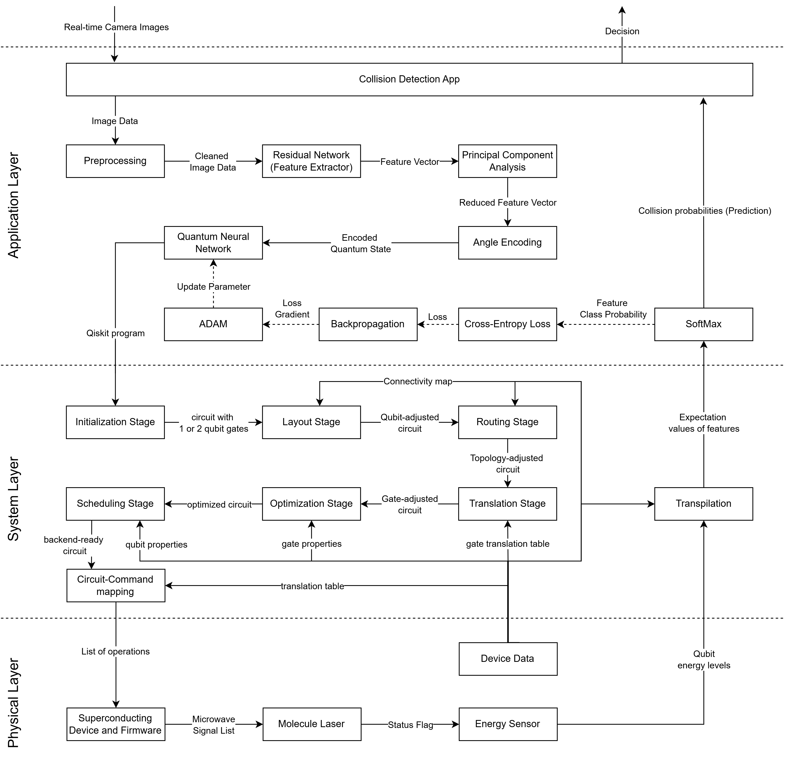

# Collision Detection using Quantum Machine Learning
This scenario covers how a Quantum Machine Learning (QML) collision detection use case maps to the layers of our architecture.
The figure below depicts the inference process with regular arrows and the training process with additional dotted arrows.

  

- Compute the probability of a collision and decide which action to take
- Input: Real-time Camera Images
- Output: Action
- Used in:
    - autonomous driving
    - drones

## Application Layer - Downwards
1. Collision Detection App
    - Takes the real-time camera images and forwards the image data to the preprocessing
   
2. Preprocessing
    - Takes the image data as input and performs resizing, rescaling, color conversion, region-of-interest extraction and denoising

3. Residual Network (ResNet)
    - Trained ResNet Backbone uses the image data to extract the features of an image
    - Creates a feature vector and forwards the Principal Component Analysis

4. Principal Component Analysis (PCA)
    - Due to the limitation in the number of qubits, this step reduces the number of features in the feature vector
      
5. Angle Encoding
    - Encodes each feature using rotational gates
    - Creates an encoded quantum state 
   
6. Quantum Neural Network
    - Appends a variational quantum circuit to the encoded quantum state
    - Sends program to the System Layer
      
## System Layer & Physical Layer
Refer to [quantum simuluation scenario](./quantum-simulation.md) for a full explanation.

## Application Layer - Upwards

7. Softmax Function 
    - Transforms expectation values of each feature into probabilities
    - Gives the Collision Detection App a collision probability
8. Cross-Entropy Loss (training only)
    - Calculates the loss of the probabilities of the features
       
10. Backpropagation (training only)
    - Takes in the loss of the features and calculates the loss gradient
      
12. Adaptive Moment Estimation (ADAM) (training only)
    - Uses the loss gradient to optimize the parameter of the quantum neural network.
